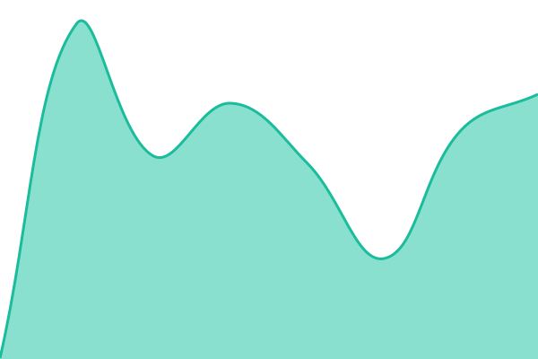
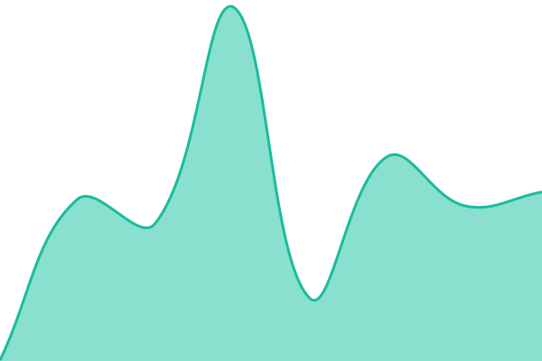
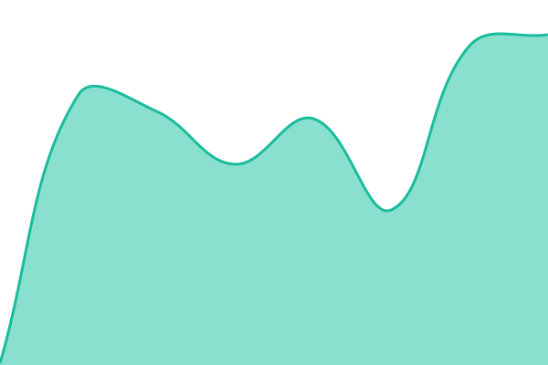

# [📈 Live Status](https://status.capitalboard.fr): <!--live status--> **🟩 All systems operational**

This repository contains the open-source uptime monitor and status page for [Armel - Capital Board](https://capitalboard.fr), powered by [Upptime](https://github.com/upptime/upptime).

With [Upptime](https://upptime.js.org), you can get your own unlimited and free uptime monitor and status page, powered entirely by a GitHub repository. We use [Issues](https://github.com/arrmel-capitalboard/capitalboard-status/issues) as incident reports, [Actions](https://github.com/arrmel-capitalboard/capitalboard-status/actions) as uptime monitors, and [Pages](https://status.capitalboard.fr) for the status page.

<!--start: status pages-->
<!-- This summary is generated by Upptime (https://github.com/upptime/upptime) -->
<!-- Do not edit this manually, your changes will be overwritten -->
<!-- prettier-ignore -->
| URL | Status | History | Response Time | Uptime |
| --- | ------ | ------- | ------------- | ------ |
|  [Site (capitalboard.fr)](https://capitalboard.fr) | 🟩 Up | [site-capitalboard-fr.yml](https://github.com/arrmel-capitalboard/capitalboard-status/commits/HEAD/history/site-capitalboard-fr.yml) | 

 235ms
     
 | 

<a href="https://status.capitalboard.fr/history/site-capitalboard-fr">100.00%</a>
    

|  [Application](https://capitalboard.fr/app.html) | 🟩 Up | [application.yml](https://github.com/arrmel-capitalboard/capitalboard-status/commits/HEAD/history/application.yml) | 

 199ms
     
 | 

<a href="https://status.capitalboard.fr/history/application">100.00%</a>
    

|  [API (Worker)](https://api.capitalboard.fr/health) | 🟩 Up | [api-worker.yml](https://github.com/arrmel-capitalboard/capitalboard-status/commits/HEAD/history/api-worker.yml) | 

 176ms
     
 | 

<a href="https://status.capitalboard.fr/history/api-worker">100.00%</a>
    

<!--end: status pages-->

[**Visit our status website →**](https://status.capitalboard.fr)

## 📄 License

- Powered by: [Upptime](https://github.com/upptime/upptime)
- Code: [MIT](./LICENSE) © [Anand Chowdhary](https://anandchowdhary.com)
- Data in the `./history` directory: [Open Database License](https://opendatacommons.org/licenses/odbl/1-0/)
